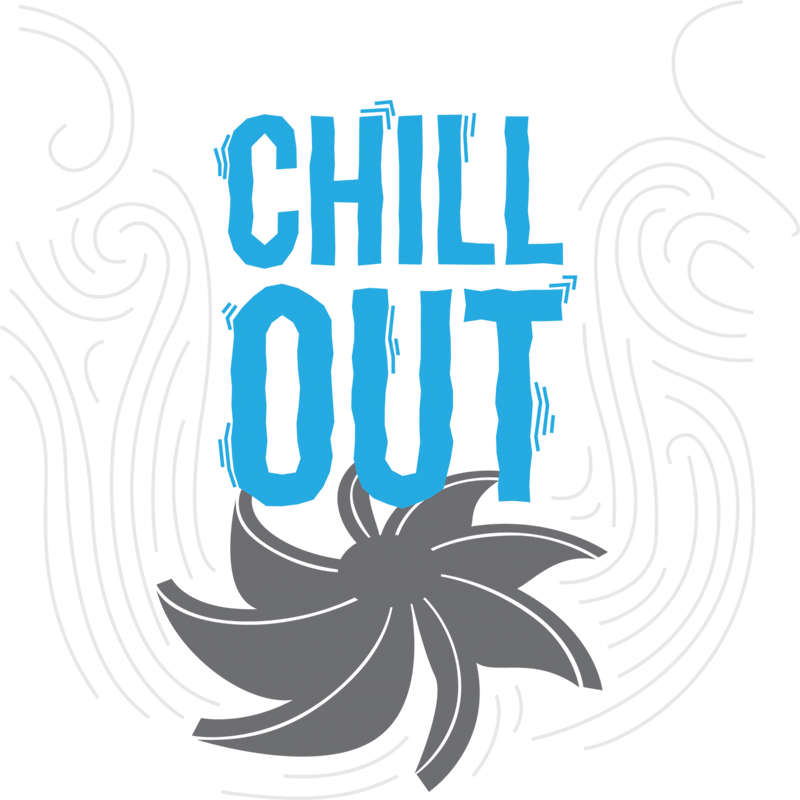

# Chill Out
```{r chillOutFig, out.width='50%', fig.align='center', echo=FALSE}

```
Unit overview text

## Educator Guide
Educator Guide version

\twocolumn

### What is Heat? {-}
Lorem ipsum dolor sit amet, consectetur adipiscing elit, sed do eiusmod tempor incididunt ut labore et dolore magna aliqua. Ut enim ad minim veniam, quis nostrud exercitation ullamco laboris nisi ut aliquip ex ea commodo consequat.

```{block, type='invention'}
Test Sit amet volutpat consequat mauris nunc congue nisi vitae suscipit. Faucibus scelerisque eleifend donec pretium vulputate sapien nec sagittis aliquam.
```

Duis aute irure dolor in reprehenderit in voluptate velit esse cillum dolore eu fugiat nulla pariatur. Excepteur sint occaecat cupidatat non proident, sunt in culpa qui officia deserunt mollit anim id est laborum.

### Keep your Cool {-}
Ullamcorper a lacus vestibulum sed arcu non odio euismod lacinia. Et pharetra pharetra massa massa. Maecenas accumsan lacus vel facilisis volutpat est velit egestas. Sit amet volutpat consequat mauris nunc congue nisi vitae suscipit. Faucibus scelerisque eleifend donec pretium vulputate sapien nec sagittis aliquam. Enim eu turpis egestas pretium. Ut etiam sit amet nisl purus in mollis. A scelerisque purus semper eget duis at. Fermentum dui faucibus in ornare quam. Sit amet purus gravida quis blandit turpis cursus in hac. Ipsum consequat nisl vel pretium lectus quam id leo. At auctor urna nunc id cursus metus aliquam eleifend. Metus vulputate eu scelerisque felis imperdiet proin. Egestas dui id ornare arcu. Ultricies mi eget mauris pharetra et ultrices neque ornare. Sed libero enim sed faucibus turpis in eu mi bibendum. Massa tincidunt dui ut ornare lectus sit amet est. Hendrerit dolor magna eget est. Est pellentesque elit ullamcorper dignissim cras tincidunt lobortis.

### Removing Heat {-}
Lorem ipsum dolor sit amet, consectetur adipiscing elit, sed do eiusmod tempor incididunt ut labore et dolore magna aliqua. Ut enim ad minim veniam, quis nostrud exercitation ullamco laboris nisi ut aliquip ex ea commodo consequat. Duis aute irure dolor in reprehenderit in voluptate velit esse cillum dolore eu fugiat nulla pariatur. Excepteur sint occaecat cupidatat non proident, sunt in culpa qui officia deserunt mollit anim id est laborum.

### Peltier Prototyping {-}
Ullamcorper a lacus vestibulum sed arcu non odio euismod lacinia. Et pharetra pharetra massa massa. Maecenas accumsan lacus vel facilisis volutpat est velit egestas. Sit amet volutpat consequat mauris nunc congue nisi vitae suscipit. Faucibus scelerisque eleifend donec pretium vulputate sapien nec sagittis aliquam. Enim eu turpis egestas pretium. Ut etiam sit amet nisl purus in mollis. A scelerisque purus semper eget duis at. Fermentum dui faucibus in ornare quam. Sit amet purus gravida quis blandit turpis cursus in hac. Ipsum consequat nisl vel pretium lectus quam id leo. At auctor urna nunc id cursus metus aliquam eleifend. Metus vulputate eu scelerisque felis imperdiet proin. Egestas dui id ornare arcu. Ultricies mi eget mauris pharetra et ultrices neque ornare. Sed libero enim sed faucibus turpis in eu mi bibendum. Massa tincidunt dui ut ornare lectus sit amet est. Hendrerit dolor magna eget est. Est pellentesque elit ullamcorper dignissim cras tincidunt lobortis.

### Invention Extension {-}
Lorem ipsum dolor sit amet, consectetur adipiscing elit, sed do eiusmod tempor incididunt ut labore et dolore magna aliqua. Ut enim ad minim veniam, quis nostrud exercitation ullamco laboris nisi ut aliquip ex ea commodo consequat. Duis aute irure dolor in reprehenderit in voluptate velit esse cillum dolore eu fugiat nulla pariatur. Excepteur sint occaecat cupidatat non proident, sunt in culpa qui officia deserunt mollit anim id est laborum.

## Appendix {-}

### Invention Worksheet {-}

### Certificate of Achievement {-} 

### Word Wall Words {-} 

### Education Standards {-}


## Student Guide
Student Guide version